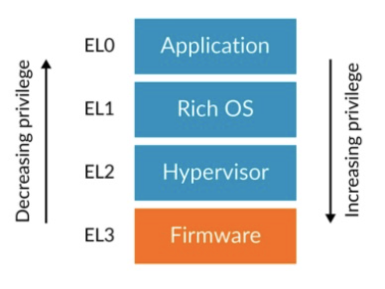

Modern software expects to be split into different modules, each with a different level of access to system and processor resources. Exception levels are referred to as `EL<x>`, with x as a number between 0 and 3 and denote the level of priviledge that part of the computer software has.

**Rich OS**: primary operating system of computer
**Hypervisor**: [[What is a hypervisor]]
**Firmware**: [[What is firmware]]

One of the kernel’s tasks is to lie to each application running in userland and to tell them that they’re the only one in the address space. It does that by using the memory management unit (MMU). The MMU allows creating an alias from a virtual address to a real physical address in e.g. RAM. The smallest granularity of this mapping is called a page which is usually 4KiB large. Each page has a virtual address and a physical address. When an instruction of an application or the kernel itself now tries to access memory at location `x` the MMU looks up the page in its pagetable and instead returns memory from another address `y`. And that’s how the kernel can give each userland application its own separate address space: It just creates a different set of pagetables for each process.
