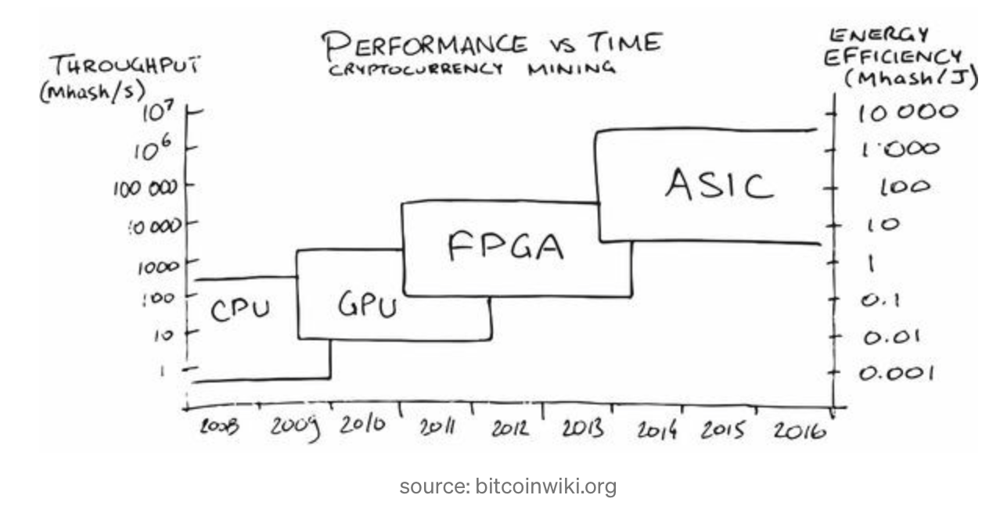

## How does Blockchain Work
- If you want a background in blockchain then you should definitely watch this 3 blue 1 brown video!!
https://www.youtube.com/watch?v=bBC-nXj3Ng4

---

## Recap
- Miners: adding blocks to transaction history by appending number such that hash of transaction block starts with $k$ zeros.
- Trust the longest blockchain
- Mining is made more difficult when there are more miners by varying $k$
- every 210,000 blocks, reward is cut in half
- Blocks have 2,400 transactions in them
- If you want your transaction to be included right in the next block, you should pay a higher fee, because then miners have more of an incentive to include your bitcoin in the block
- Private key only you know -> generates public address for you to receive bitcoin
- Ledger associates a public key with transactions which stores who has how much money

---
## Miner Details (haha)
- Bitcoin nodes communicate over TCP (basically the internet)
- Each bitcoin miner is connected to a few other bitcoin miners randomly creating a web of connected miners
- A valid transaction sent to any miner will propogate through connected miners exponentially fast until all connected nodes have received it.

---
## Full Nodes

Full nodes- computers that store a complete copy of the blockchain and is able to verify all transactions since the beginning.
- You don't get any money from running a full node.
- There is increased security for a full node and it will always have the latest and greatest information relating to information on bitcoin’s blockchain (useful for wanting to know the price of bitcoin)
- Full nodes also track UTXO (Unspent transaction output) set which is the amount of money each public address has available to spend
	- When a miner receives info about a new transaction, it checks whether all of the inputs of an incoming transaction exist in the UTXO set to see if it's valid.

---

## What if Miners Mine a Block at the Same Time?
- When a new block is found, every full node and miner is sent the block to check if it's legit and add it to the chain.
- Some miners and full nodes are sent block A quicker than B and therefore reject B, while others are sent block B first. Both are completely valid.
- Nodes that are sent block A first will try to find the next block based on using the hash of A, while the other miners will use the hash of B.
- Since the "true" chain is the longest one, if the group hashing the next block based on A finds a hash first, this will become the new truth in the network.

---

## Wallets
Hot Wallet
	- Online wallets are also known as “hot” wallets. Hot wallets are wallets that run on internet-connected devices like computers, phones, or tablets.
	- If you have your account on coinbase, robinhood, etc. then you're holding through their online wallet with their own private key, you don't have your own.
- Cold wallet
	- local on your device

---

## What happens when 21 million run out
- The bitcoin halving
	- The first rule of the Bitcoin system is that there can be a maximum of 21,000,000 Bitcoins generated. This number has still not been achieved, and according to current trends, it is thought that this number will be reached by the year 2140.
	- The first 18.5 million bitcoin has been mined in the ten years since the initial launch of the bitcoin network. With only three million more coins to go, it might appear like we are in the final stages of bitcoin mining.
	- Transaction fee may mean that bitcoin miners still mine after they expire
- Miners return is way higher

---

## Hash Attack
- Amount that miners can mine is enforced so that the amount of bitcoin given out is constant
- If I'm a miner why wouldn't I just come in and mine a lot when the the rate of mining is low which drives up the hash rate, making the algorithm increase the difficulty to mine a block

---

## Hash Attack
- For Bitcoin the difficulty is adjusted every 2016 blocks (every 2 weeks approximately) so that the average time between each block remains 10 minutes.
- Other coins use smaller time scales and numbers of blocks to adjust on (smaller time scales mean you can have more transactions cause you have more blocks)
- But if you have more blocks the people running the full nodes need a proportional amount of memory to store the info from each block

---

## Interesting Bitcoin Transaction Cases
- Bitcoin arbitration (escrow):
	- https://www.bitrated.com
	- 3rd party to sign transaction
- Microtransactions
	- what if you have a few micro transactions are the amount of transaction fees?
	- You can real time update on a contract to the network a bunch of incremental payments every time a service is performanced and then actually send the total of payments at the end of the day

---

## Anonymity

- Anonymity
	- She knows every transaction gets added to the public block chain, so when Bob and Charlie pay her, they can each easily track those satoshis to learn what Bitcoin addresses she pays, how much she pays them, and possibly how many satoshis she has left.
	- **Coinjoin** takes a bunch of peoples bitcoins together and collectively agree to transfer satoshis between each other so no one besides them can reliably determine who controls which satoshis.
		- They then each generate a brand new public key that the money is sent to
	- Bitcoin isn't truly anonymous though because if you have access to the full transaction history of the network, and you talk to the other people in the CoinJoin transaction, you can figure out who the coins ultimately belonged to

---

## Mining Hardware

---

## Mining Hardware

- Introduction of ASICs can yield up to 100 billion times the capability of personal machines for bitcoin mining
- Cloud mining is gaining popularity

---

## What are different variations of the algorithm
- **proof-of-work**: need to find a specific value for a variable that will produce a HASH beginning with specific number of zeros.
- Etherium switched algorithm from proof of work to **proof of stake**
	- for **proof of work**, miners need a ton of energy. One Bitcoin transaction requires the same amount of electricity as powering 1.57 American households for one day. Bitcoin transactions may consume as much electricity as Denmark by 2020. (https://blockgeeks.com/bitcoin-transactions/)

---

## Proof of Stake
- Replaces **miners** with **validators**. Validators will have to lock up some of their coins as a stake (costs 32 ETH to run a validator node)
- Validators are randomly selected to propose a block.
- Each time a block is set to be proposed, randomly chosen committees (between 4-64) of 128 validator nodes are selected from the entire pool of validators to verify the block.
-  If the validator proposes a fraudulent block that's rejected, then some of their staked amount will be be taken away.

---

## 51% Stake Attack
Need to take on 51% stake in a cryptocurrency to attack the network, but why would someone with such a large stake attack the network and risk losing their money? A large hack would also reduce value of crypto, meaning attacker would lose a lot of their money.

---

## Cryptocurrency apps
- https://www.stateofthedapps.com
### Etherium DAPPS
- buying cryptokitties

--- 

### Etherium DAPPS

---

### Etherium DAPPS
- Robbie on SuperRare
	- https://superrare.co/artwork/ai-generated-nude-portrait-1-1
- non-fungible token (_NFT_)
	- https://rarible.com
	- https://godsunchained.com
		- like hearthstone but a lot of real money
- https://www.maecenas.co

---

## Ripple: What is SWIFT
SWIFT (Society for Worldwide Interbank Financial Telecommunication)
-  global standard in the 1970s introduced to send messages between banks worldwide and keep track of payment recordss
- SWIFT made new system Global Payments Innovation (GPI), completing half of its payments in under 30 minutes.
- In general, transferring money between banks is slow and can take a few days with SWIFT. Sometimes to transfer money between unconnected banks it has to go through a bunch of intermediary banks.
- It's also confusing to between banks that use different currencies. Usually banks use dollars as an intermediary currency to swap between currencies that don't have a trading market. Dealing with exchange rates and stuff.

---

## Enter Ripple
- RTXP (ripple transaction protocol), instead of say something like HTTP
	- **Validators** are computers around the world that share a ledger of transactions
	- **Gateways** are created by large financial institutions and act as entry points into the ripple network
	- **IOUs** are tokens that can be stored in your ripple wallet. They represent debt, so if you issue one to someone then you owe them the corresponding amount of money.
		- takes form like USD.Bitstamp or Oil.BankOfAmerica (<the currency/asset>.< who issues the IOU >)

---

## What is XRP
**XRP** is a cryptocurrency that runs on blockchain network to act as the intermediary currency that can immediately be transferred from bank to bank via blockchain network
- Main use case of network because it's fast and actually sends the asset instead of a message/IOU
- **XRP** is super volatile though being a cryptocurrency, so banks can use IOUs instead
- For a transaction XRP takes avg 4 seconds vs bitcoins 10 min
- XRP handles 1500 transactions per second while bitcoin can only handle 7
-   Each validator maintains a unique node list (UNL) of trusted peers, which is a set of other servers that s queries when determining consensus.

---

## Ripple Consensus Algorithm
The XRP Ledger uses a “Byzantine Consensus Algorithm”:
	1.   Every validator takes all valid transactions it has seen prior to the beginning of the consensus round that have not already been applied and makes them public in the form of a list known as the “candidate set”.
	2.  Each validator then combines the candidate sets of all nodes on its UNL, and votes on the veracity of all transactions.
	3.   Transactions that receive more than a minimum percentage of “yes” votes are passed on to the next round, if there is one, while transactions that do not receive enough votes will either be discarded, or included in the candidate set for the beginning of the consensus process on the next ledger.
	4.  A transaction is included in final ledger only if consensus among nodes is reached with super-majority (>80% agreement) of peers
-  Validators don't get paid, so they would probably would mostly be people who need XRP network to be around

---

## Other Cryptos
- Tether (USDT)
	- tracks price of the US dollar
- STORJ
	- Decentralized Cloud Storage where you are paid in cryptocurrency to offer up some of your harddrive space for storage

---

## Random Bitcoin Facts
Firms buying bitcoin:
- MicroStrategy buys $650 million in Dec 2020
- Square invests in Oct 2020 to buy about $50 million
- Options in bitcoin
- Bitcoin credit cards (my dad is getting one)
- companies are buying bitcoin