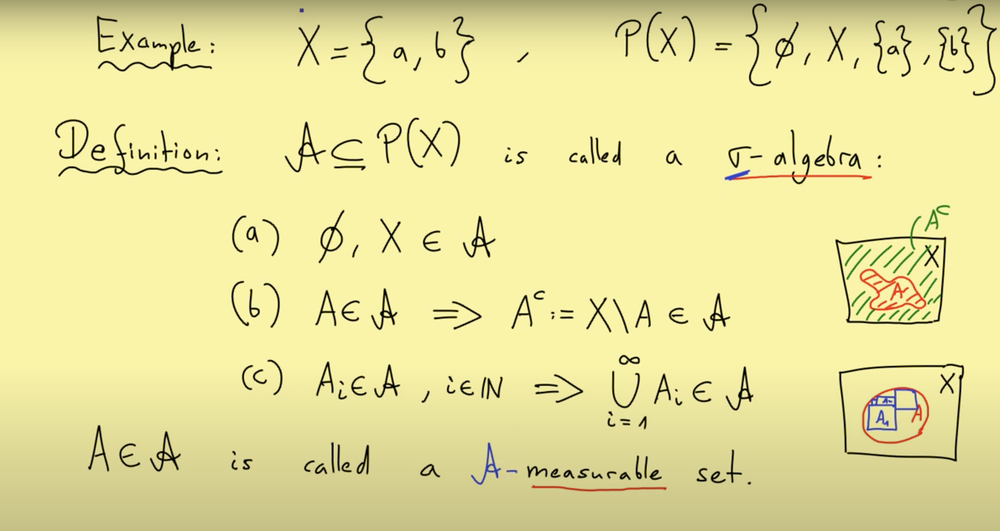
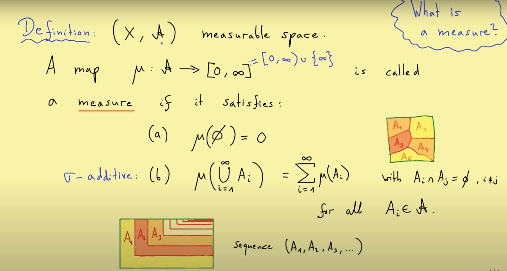
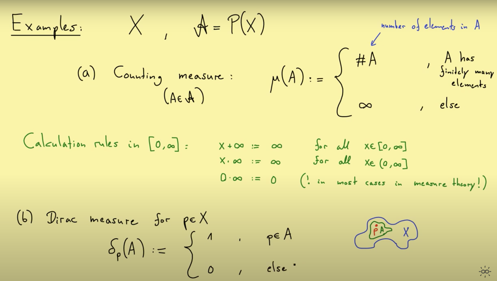
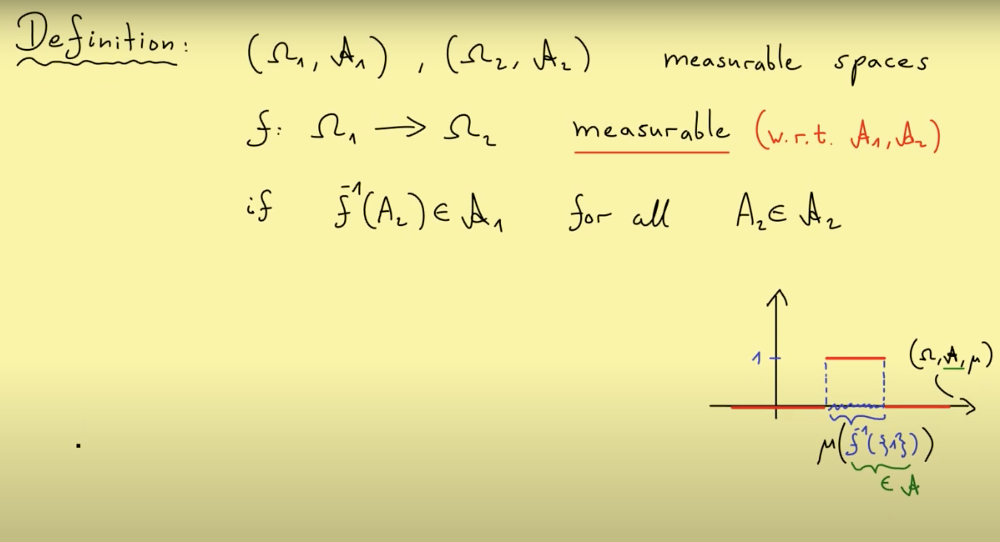
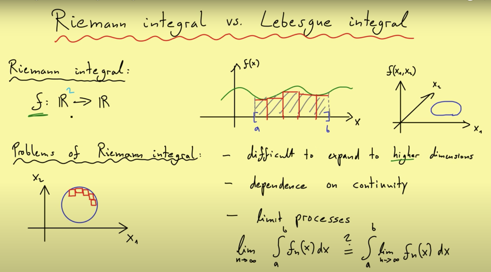
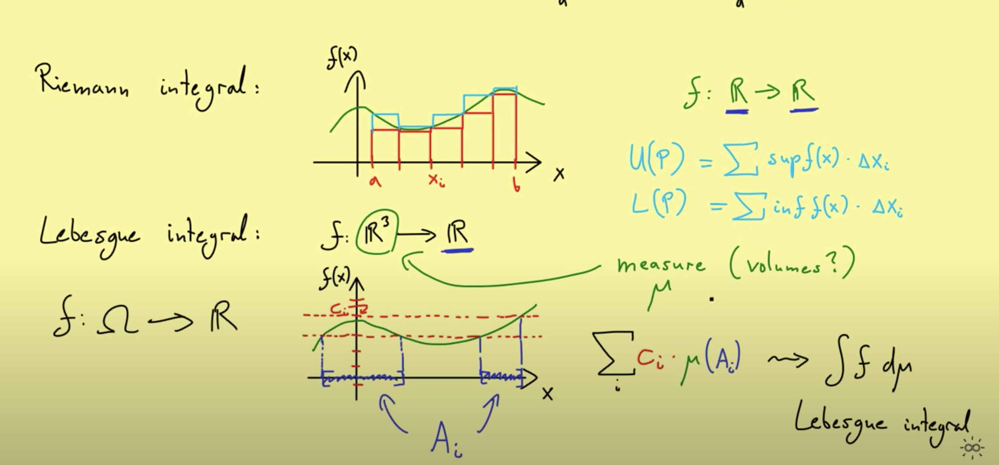
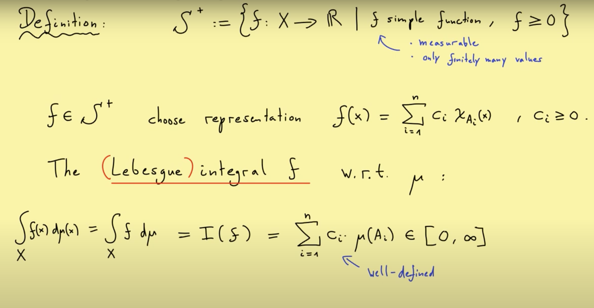
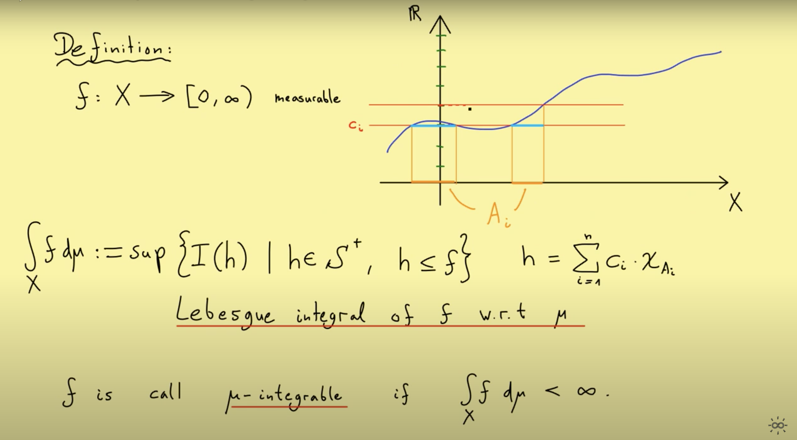

A sigma algebra is a special collection of specific subsets of a set $$X$$ that satisfy 3 following properties:

We can then define a measure map as the following:

Here are some examples of measures:

We can say a function mapping is measurable if the following condition holds:

## Lebesgue Integral

### Problems with the Reimann Integral

### Reimann vs Lebesgue Integral

### Defining the Lebesgue Integral

For simple (step, staircase, ...) functions the Lebesgue Integral is defined as follows (where $\chi_A$ is some function mapping $x$ to the real numbers and $I(\chi_A) = \mu(A)$:

Generally, it is defined as follows:

The integral of a measurable function $f$ is the supremum of the set of all integral values for step functions that lie below the function $f$.