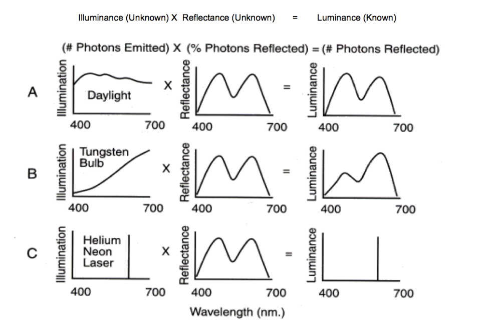
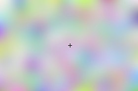

### Attention Window

We have a limited 30x30 attention window where if we want to look at something bigger, the quality of the object decreases

### How we view colors

Although we see the luminance, our brain corrects for what it believes is the illumninance to learn the object's true reflectance color.

### Troxler Effect

Stare at the black plus sign in the middle of the image and don't blink.

The colors around the black plus sign should fade away, and the background should become entirely grey. This is because our brain is wired to recognize stimuli that are large relative to our current focus. If we focus on the background we can recognize its distinct colors easily. But, when we focus our complete attention on something like the plus sign which is very different from the rest of the image the background colors are not as potent so our perception ignores them and turns the entire background grey.

### Aperture Problem
- Check out how the movement of the black in the aperture [here](https://commons.wikimedia.org/wiki/File:Aperture_problem_animated.gif)
- It looks like lines are moving diagonally to the right and down
- What's really happening is that the lines are just moving to the right. You will see this if you remove the aperture and look at the entire lines
- Viewing how the corners of an object moves is very important for our brain to determine the constraints of that object and how the entire thing is moving

### Texture Reconstruction in Images
- A popular method of reproducing the way that certain textures looked in an image was to measure a histogram of pixel values in the original image texture and then just ensure that the simulated texture has the same histogram of pixel values. This method (along with using some other techniques in addition) worked surprisingly well.