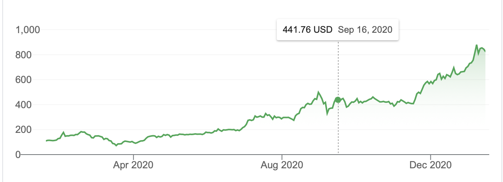
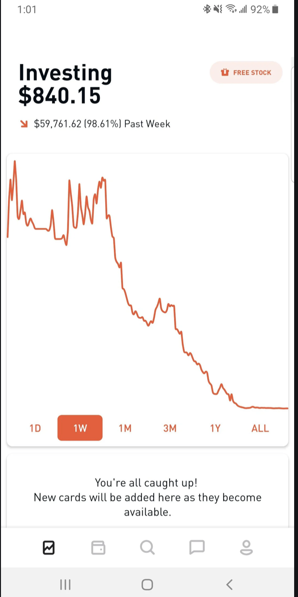
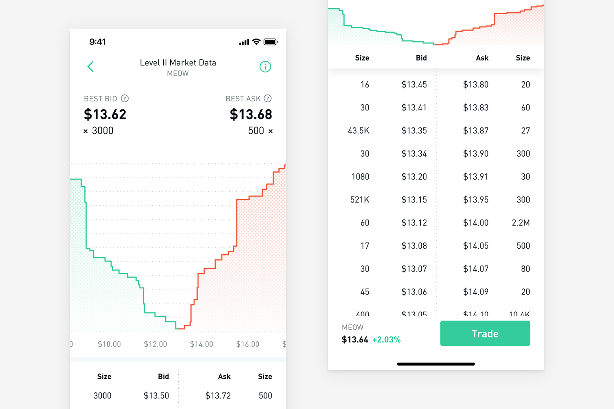

## Part 1: Crypto DApps

---

## Cryptocurrency apps
- https://www.stateofthedapps.com

---
### Etherium DAPPS
- Robbie on SuperRare
	- https://superrare.co/artwork/ai-generated-nude-portrait-1-1
- non-fungible token (_NFT_)
	- https://rarible.com
	- https://godsunchained.com
		- like hearthstone but a lot of real money
- https://www.maecenas.co

---

## Other Cryptos
- Tether (USDT)
	- tracks price of the US dollar
- STORJ
	- Decentralized Cloud Storage where you are paid in cryptocurrency to offer up some of your hard drive space for storage

---

## Random Bitcoin Facts
Companies buying bitcoin:
- MicroStrategy buys $650 million in Dec 2020
- Square invests in Oct 2020 to buy about $50 million

Options in bitcoin
Bitcoin credit cards

---

## Part 2: How Does a Market Work

---

##  Bid and Ask Price Plot

---

##  Bid and Ask Price Plot

---

##  Bid and Ask Price Plot

---

## There are 2 types of orders
- limit order
- market order
---

## Why can I execute trade right away
- market makers like Virtu can arbitrage by placing orders on both sides of market
- also they are paid by exchanges to provide liquidity (meaning they are paid to put their limit orders)

---

## Why is robinhood trading free
- If you place limit order you are being paid to place your order by exchange, so you get to place it for free on robinhood
- if you place market order, they sell that order to the market makers:
	- in return marker makers get an order crossing the spread as well as information quicker than anyone else what direcation the order is coming from
- Slippage: difference in best market price and what you actually pay:
	- delay in trade execution