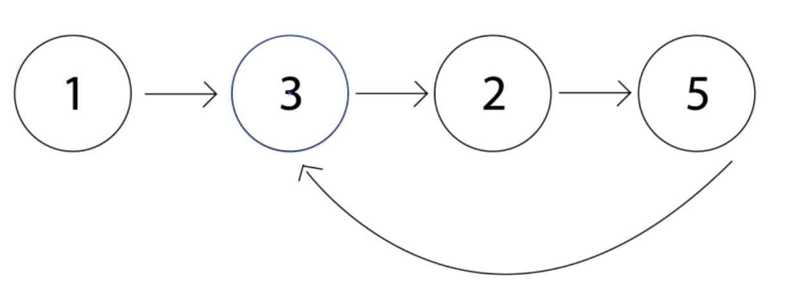
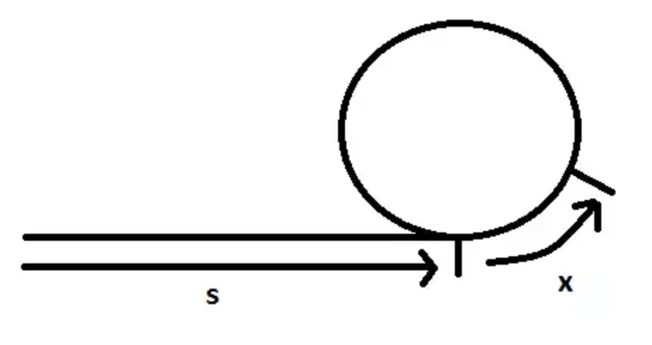

## Problem
We want to find the location of a cycle in a graph.

Notice how in this graph that there is a cycle starting at node 6.

## Solution
We traverse the graph with a tortoise, that visits the graph node by node:
`new_node = current_node.next`
and a hare that traverses the graph at twice the speed jumping to the node after the next node every time:
`new_node = current_node.next.next`

If the tortoise and the hare meet, then there must be a cycle in the graph, otherwise the hare would have just exited the graph. When the tortoise and the hare meet, the hare will have traveled across twice as many nodes as the tortoise.

Let's say that there are $s$ nodes until the entrance of the cycle, and that the tortoise and hare meet after traversing $x$ nodes (including the node they meet at) into the cycle. So, at this point the tortoise has traveled $s+x$ and the hare has traveled $2(s+x)$ when they meet. This means that if we move the hare another $s+x$ points it will go back to the meeting point again. So, if we move it only $s$ nodes forward, it will be at the start of the cycle. Therefore, if we set the tortoise back to the beginning and have the hare move at the tortoise's pace of 1 node per iteration, then they will meet at the node $s$ nodes into the graph. This is the start of the cycle, and you have your answer to where the cycle starts.

Runtime is $O(n)$ and memory is $O(1)$.