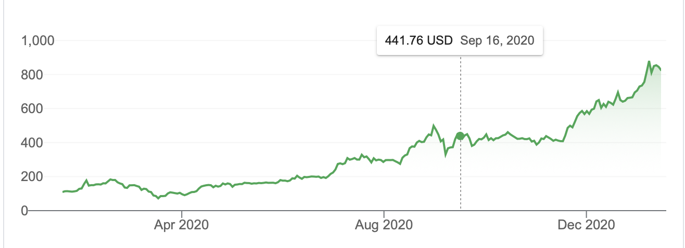
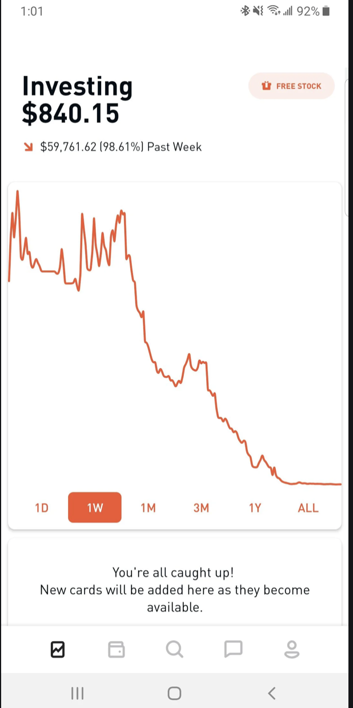
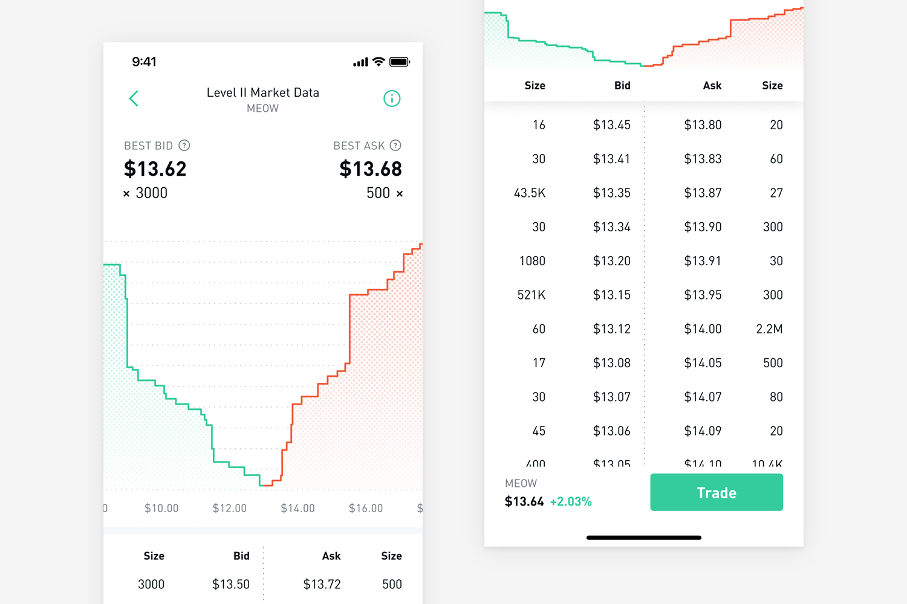

## How Does a Market Work

---

##  Bid and Ask Price Plot

---

##  Bid and Ask Price Plot

---

##  Bid and Ask Price Plot

---

## There are 2 types of orders
- limit order
- market order

---

## Why can I execute trade right away
- market makers like Virtu can arbitrage by placing orders on both sides of market
- also they are paid by exchanges to provide liquidity (meaning they are paid to put their limit orders)

---

## Why is robinhood trading free
- If you place limit order you are being paid to place your order by exchange, so you get to place it for free on robinhood
- if you place market order, they sell that order to the market makers:
	- in return marker makers get an order crossing the spread as well as information quicker than anyone else what direcation the order is coming from
- Slippage: difference in best market price and what you actually pay:
	- delay in trade execution