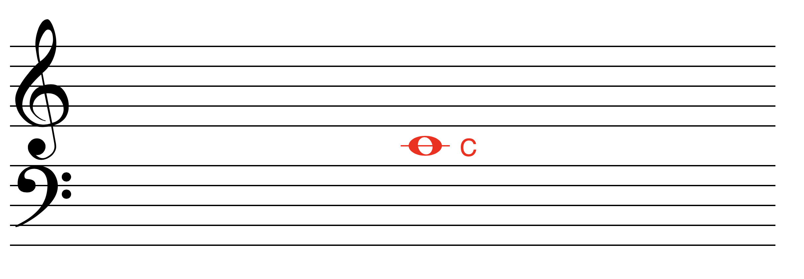
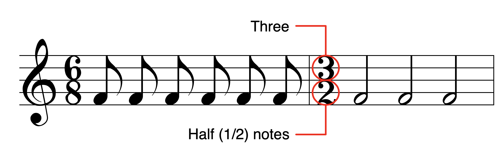
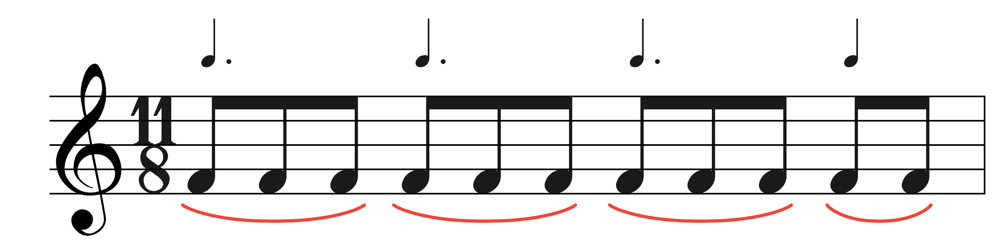

## Clefs
The base and treble clef are basically continuations of one another, but just separated but a middle C.
- so bottom of treble is E and top of base is A

- As you go higher up you cycle forwards through alphabet A-G, so as you go down you cycle backwards through alphabet

## Time Signature
- Bottom number displays which type of note (note length) we use to count for that measure (this means which note gets the beat)
- Top number displays how many of that note we have in each measure

- In this image we see 6/8, so the eighth note is what we use to count beats in this measure, and we allow the equivalent of 6 eighth notes per measure.
	- Often we change the time signature to fit the tempo of the underlying piece, so for example songs with much quicker tempos may opt to use a 3/2 time signature because the music piece may be dominated by very fast half-notes.
	- If we keep the same tempo in a piece but switch from a measure with a 4/4 time signature to a 6/8 time signature, then we will spend different amounts of time in each measure. In the 1st measure we would stay there for 4 quarter note beats, but in the 2nd measure after the switch we would stay there for 6 eighth note beats (or 3 quarter note beats)

- When counting measures that aren't as straight forward you can count them in terms of quarter/dotted-quarter notes. The above example could be counted as: 1+2,2+2,3+2,4+....1 repeat

# Scales
## Major Scale
- A major scale is always constructed via the following formula after starting from the root (W is a whole step and h is a half step):

Here is the E Flat major scale:
![[Screen Shot 2020-12-01 at 9.09.39 PM.png]]

## Minor Scales
- there are 3 different versions of minor scales: natural minor, harmonic minor, melodic minor
### Natural Minor
![[Screen Shot 2020-12-01 at 9.12.16 PM.png]]
- To make a harmonic minor scale, take the minor scale and raise the 7th note by 1 half step
- To make a melodic minor scale, take the minor scale and raise the 6th and 7th notes by 1 half step
## Note Labels in Scales
![[Screen Shot 2020-12-01 at 9.24.55 PM.png]]
- notice that the first and last notes are both called the tonic, because they are the same note, just in different octaves
- the 7th note is special, because it changes depending on type of scale. When the 7th note is a half step below the tonic, it is called the leading tone, because it sounds like it leads into the tonic. When the 7th note is a whole step below the tonic, then it is called the subtonic

## Key Signatures
- When we say something is in the key of A major, that means we take all the accidentals (sharps/flats) that occur in that scale and making that our key signature

# Intervals
![[Screen Shot 2020-12-14 at 7.41.46 PM.png]]
- Chart shows the number of half steps an interval is between two notes

![[Screen Shot 2020-12-14 at 7.44.48 PM.png]]
- Interval inversions (shifting the bottom note up an octave) always has the above transformation rules.

# Chords
- a chord is a combination of 3 or more notes at once
- Think of chords originating at the base note, and then every note is built off the base (ie a perfect fifth, major third, minor seventh, etc.)

## Major Triad
![[Screen Shot 2020-12-01 at 8.42.19 PM.png]]
- A major triad is made up of a root (the bottom-most note on the scale), a minor third, and a perfect fifth
	- For C major triad for example, we start at C, move up 4 half steps (a half step means to go up 1 key on keyboard, like C to C#) to get the major 3rd, then from the root count up 7 half steps for the perfect 5th

## Minor Triad
 ![[Screen Shot 2020-12-01 at 8.56.07 PM.png]]
-  A major triad is made up of a root, a minor third, and a perfect fifth
	-  For C major triad for example, we start at C, move up 3 half steps to get the minor 3rd, then from the root count up 7 half steps for the perfect 5th

## Augmented Triad
![[Screen Shot 2020-12-01 at 9.00.49 PM.png]]
- An augmented triad is made up of a root, a major third, and an augmented fifth
	-  For C augmented triad for example, we start at C, move up 4 half steps to get the major 3rd, then from the root count up 8 half steps for the augmented 5th

## Diminished Triad
![[Screen Shot 2020-12-01 at 9.02.24 PM.png]]
- A diminished triad is made up of a root, a minor third, and a diminished fifth
	-  For C diminished triad for example, we start at C, move up 3 half steps to get the minor 3rd, then from the root count up 6 half steps for the augmented 5th

## Seventh Chord
![[Screen Shot 2020-12-14 at 7.59.03 PM.png]]
- I personally like the sound of M7 and m7
- Major 7th is 11 half steps from root
- Minor 7th is 10 half steps from root

## Diatonic Triads
![[Screen Shot 2020-12-14 at 8.05.25 PM.png]]
- For major diatonic triad just take the major scale and stack 2 generic thirds
- For natural minor diatonic triad just take the minor scale and stack 2 generic thirds
- For harmonic minor diatonic triad just take the minor triads and raise the 7th tone 1/2 step (then for melodic raise 6th tone 1/2 step from harmonic)

![[Screen Shot 2020-12-14 at 8.05.46 PM.png]]
- Analyzing triads

![[Screen Shot 2020-12-14 at 8.06.25 PM.png]]
- Analyzing inversions

## Diatonic Sevenths
![[Screen Shot 2020-12-14 at 8.13.00 PM.png]]
- Similar to diatonic triad, but instead you stack 3 generic thirds

![[Screen Shot 2020-12-14 at 8.15.22 PM.png]]
- How to use roman numeral labeling for sevenths

![[Screen Shot 2020-12-14 at 8.17.33 PM.png]]
- Analyzing inversions

## Voicing
- Composers often arrange the notes of a chord in different ways to vary the sound, but the chord is still the same. As long as you maintain using the same notes and keep the same root note, the chord is the same. For example, here are variations of the F major triad:
![[Screen Shot 2020-12-14 at 8.23.48 PM.png]]

## Analyzing Music
- Checkout this lesson https://www.musictheory.net/lessons/52 to go over and identify the different chords in *O Canada!*