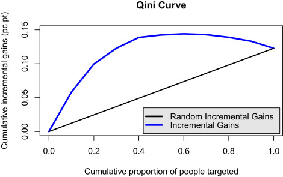

---
## Metrics like Current Selection Metric
1. Top bin hybrid tau ATE * Spearman ranking correlation of bins
2. Top bin hybrid tau ATE * sqrt(Spearman ranking correlation of bins)
3. Top bin: (E[Y_{A=1}] - E[Y_{A=0}]) * Spearman ranking correlation of bins

---
## Qini Curve

The Qini Curve is a graph of the Cumulative ITE on the treated when you sort ITE from highest to lowest
- We can calculate the area between this curve and the random uplift curve
---
## Qini Curve Metrics
where $\phi_i = i/M$.

$$\text { Qini Curve Area }=\sum_{i=0}^{M-1} \frac{1}{2}\left(\operatorname{Qini} \operatorname{curve}\left(\phi_{i+1}\right)+\operatorname{Qini} \operatorname{curve}\left(\phi_{i}\right)\right)\left(\phi_{i+1}-\phi_{i}\right)$$

$$\text { Randomized Qini Area }= \frac{1}{2}(\operatorname{Qini} \operatorname{curve}(\phi_{M}))$$

$$Q = \text { Qini Curve Area } - \text { Randomized Qini Area }$$
