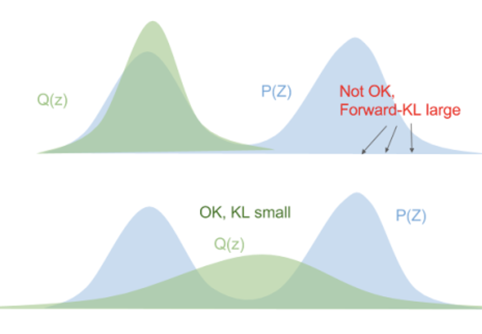
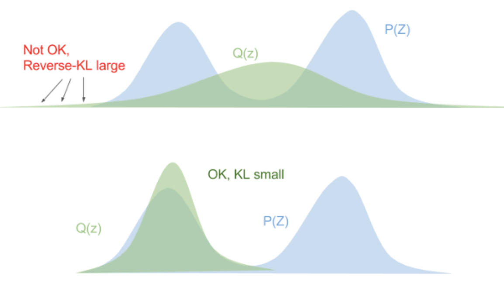

- Firstly, the word "variational" is a fancy word for optimization-based formulas

## The Challenge

Direct inference on our distribution $$P$$ can be intractable

- We can approximate inference on $$P$$ by projecting it to a family of distributions $$Q$$ and perform inference on this new distribution family
- We select the projection that minimizes the KL divergence $$D_{K L}(Q \| P)=\int_{-\infty}^{\infty} q(\theta) \log \frac{q(\theta)}{p(\theta , X)} d \theta$$ 

## KL Divergence

| $$D_{KL}(P\|Q) = \sum_i p(x_i)\log \frac{p(x_i)}{q(x_i)}$$     | $$D_{KL}(Q\|P) = \sum_iq(x_i)\log \frac{q(x_i)}{p(x_i)}$$      |
| ------------------------------------------------------------ | ------------------------------------------------------------ |
|  |  |

- We try to minimize the reverse KL since it has the nice tendency to make our $$Q$$ distribution match at least one of the modes of $$P$$, which is the best we could hope for with the shape of our approximation.
- However, we can't actually minimize this directly since it depends on the intractable distribution $$p$$ so we actually maximize the evidence lower bound (ELBO) ([check this link for the math](http://bjlkeng.github.io/posts/variational-bayes-and-the-mean-field-approximation/))

## Mean Field Approximation

We assume that the $$Q$$ distribution partitions our variables of interest into independent parts:

$$
p(\theta | X) \approx q(\theta)=q\left(\theta_{1}, \ldots, \theta_{n}\right)=\prod_{i=1}^{N} q_{i}\left(\theta_{i}\right)
$$

Suppose that we are interested in finding the joint probability $$p(\beta,\omega,z)$$, then based on our assumption of the distribution $$Q$$:

$$
q(\beta, \theta, \boldsymbol{z})=\prod_{k} q\left(\beta_{k}\right) \prod_{d} q\left(\theta_{d}\right) \prod_{n} q\left(z_{d n}\right)
$$

Solving for the optimal $$q_j(\theta_j)$$ yields that ([check this link for the math](http://bjlkeng.github.io/posts/variational-bayes-and-the-mean-field-approximation/)):

$$
q_{j}\left(\theta_{j}\right) \propto e^{E_{m | m \neq j}[\log p(\theta, X)]}
$$

where 
$$E_{m | m \neq j}[\log p(\theta, X)]=\int_{\theta_{m | m \neq j}}\left[\prod_{i \neq j} q_{i}\left(\theta_{i}\right)\right] \log p(\theta, X) d \theta_{1} \ldots, d \theta_{j-1}, d \theta_{j+1}, \ldots, d \theta_{n}$$
is the expectation across all variables except for $$j$$.

Now the algorithm goes:

1. For each $$q_j$$ use the above equation to minimize the overall KL divergence by updating $$q_j(\theta_j)$$ holding all the others constant.
2. Repeat until convergence