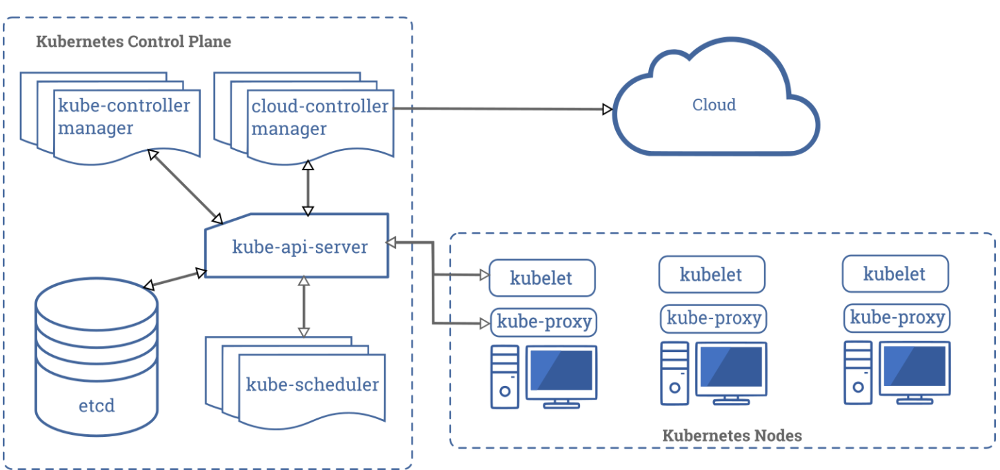
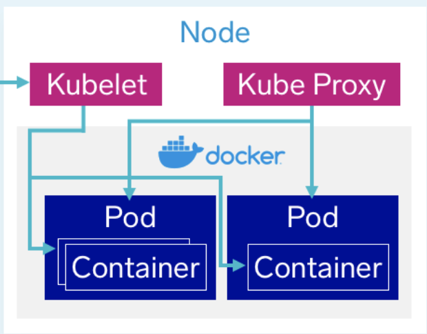

Kubernetes is a container orchestration system that automates the deployment, scheduling and scaling of containerized applications.

- The **Control Plane’s** components make global decisions about the cluster.
- **kube-apiserver** is the main implementation of a Kubernetes API server which acts as the front end for users to interact with the Kubernetes control plane.
- **etcd** is used to store key-value information about all nodes in the cluster.
- **kube-scheduler** watches for newly created pods with no assigned node, and selects a node for them to run on based on a variety of factors.
- **kube-controller-manager** runs a control loop that watches the shared state of the cluster through the apiserver and makes changes attempting to move the current state towards the desired state.
- **cloud-controller-manager** runs controllers that interact with the underlying cloud providers. Since cloud providers develop and release at a different pace compared to the Kubernetes project, the cloud-controller-manager allows the cloud vendor’s code and the Kubernetes code to evolve independently.

- A **node** is an instance of a computer that runs pods. Each node has **Kubelet**, which takes a set of PodSpecs that are provided through various mechanisms and ensures that the containers described in those PodSpecs are running and healthy.
- **Kube-proxy** maintains network rules on nodes. These network rules allow network communication to your Pods from network sessions inside or outside of your cluster.
- A **pod** is a set of running containers on your cluster.