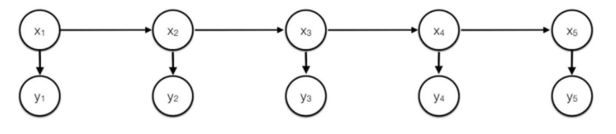

The Hidden Markov Model (HMM) is a time series model that assumes the ground truth is made up of observed variables that we see $o_1,...,o_t$ and hidden variables $s_1,...,s_t$ that we never see but determine the values we observe. There are two main assumptions with the HMM:
1. $P(s_t \mid s_{t-1}, s_{t-2},...,s_{1}) = P(s_t \mid s_{t-1})$
2. $P(o_t \mid o_{t-1}, o_{t-2},...,o_{1}, s_{t}, s_{t-1},...,s_{1}) = P(s_t \mid s_{t-1}) = P(o_t \mid s_{t})$

- The first assumption means that the next hidden state is only dependent on the directly previous hidden state and none of the other past hidden states.
- The second assumption means that the observation at a certain time point is only dependent on the hidden state at that time point.

Here is a visualization of what the HMM looks like where $x_t$ are the hidden states and $y_t$ are the observed values.

There are 3 main problems we can solve with the HMM model, where $A$ is a $n \times n$ matrix of transition probabilities like $P(s_{t} \mid s_{t-1})$, $B$ is a $n \times v$ matrix of emission probabilities like $P(o_{t} \mid s_{t})$, $O$ is the sequence of observed values, and $S$ is the sequence of states. This model assumes that transition and emission probabilities are constant over time (but this can be generalized by having $A$ as a $T \times n \times n$ tensor).
1. Compute $P(O \mid A,B)$
2. Compute $S^* = \text{argmax}_{S} P(S,O \mid A,B)$
3. Compute $A^*,B^* = \text{argmax}_{A,B} P(O \mid A,B)$